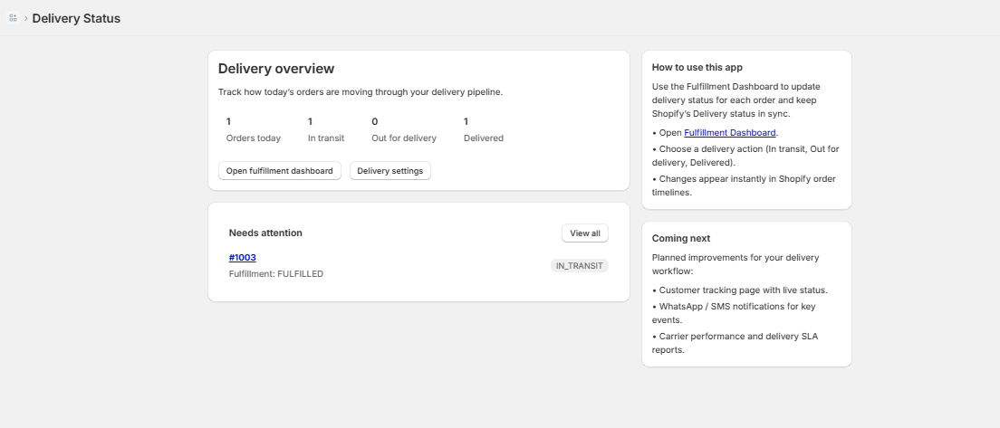
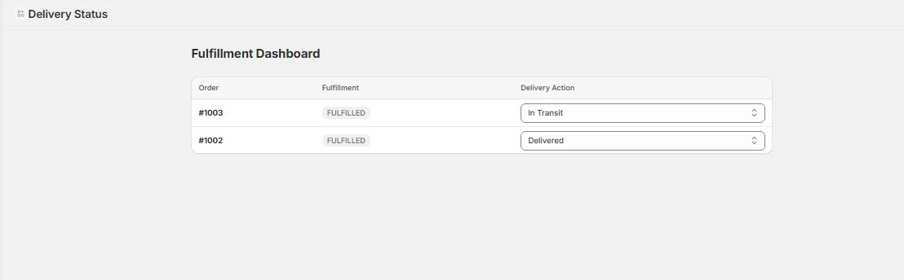
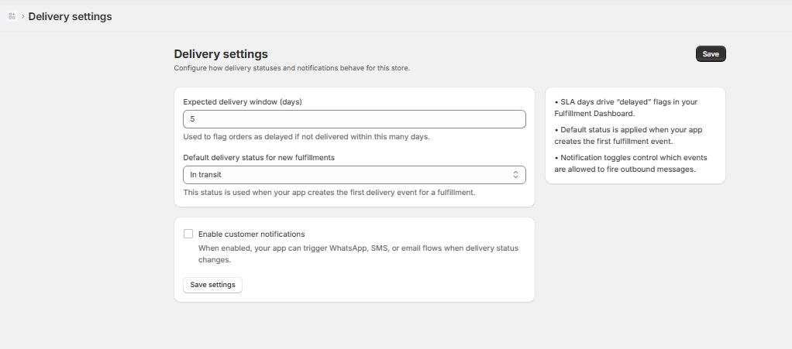
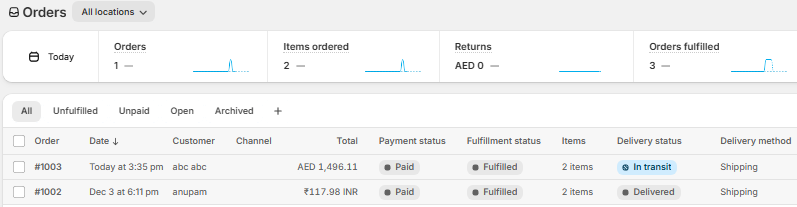

# Shopify App Template - Remix

> [!NOTE]
> **Remix is now React Router.** As of [React Router v7](https://remix.run/blog/merging-remix-and-react-router), Remix and React Router have merged.
> 
> For new projects, use the **[Shopify App Template - React Router](https://github.com/Shopify/shopify-app-template-react-router)** instead.
> 
> To migrate your existing Remix app, follow the **[migration guide](https://github.com/Shopify/shopify-app-template-react-router/wiki/Upgrading-from-Remix)**.

This is a template for building a [Shopify app](https://shopify.dev/docs/apps/getting-started) using the [Remix](https://remix.run) framework.

Rather than cloning this repo, you can use your preferred package manager and the Shopify CLI with [these steps](https://shopify.dev/docs/apps/getting-started/create).

Visit the [`shopify.dev` documentation](https://shopify.dev/docs/api/shopify-app-remix) for more details on the Remix app package.

## Screenshots

### Home dashboard



### Fulfillment dashboard



### Delivery settings



### Shopify Orders - check Delivery status column




# Delivery Status – Custom Shopify Fulfillment App

Delivery Status is an embedded Shopify app that gives merchants a simple dashboard to monitor orders and update delivery status using Shopify fulfillment events.

The app is built as a real production‑style example to demonstrate end‑to‑end Shopify app development: Admin GraphQL, App Bridge, Polaris UI, and fulfilment events.

---

## Features

- **Fulfillment Dashboard**  
  - Lists recent orders with fulfillment status.  
  - Allows merchants to set delivery status (In transit, Out for delivery, Delivered) using `fulfillmentEventCreate`.  
  - Status changes are reflected directly in Shopify’s order timeline and “Delivery status” column.

- **Home Dashboard**  
  - KPIs: Today’s orders, In transit, Out for delivery, Delivered.  
  - “Needs attention” list for orders stuck in transit or out for delivery.

- **Delivery Settings**  
  - Expected delivery window (SLA) in days.  
  - Default delivery status for new fulfillments.  
  - Toggles for customer notifications (future integration with WhatsApp/SMS/email).

- **Clean Shopify App Architecture**  
  - Remix routes for Home, Orders dashboard, and Settings.  
  - Uses Shopify App Bridge + Polaris for a native Admin look and feel.

---

## Tech stack

- **Framework:** Remix (TypeScript)  
- **UI:** Shopify Polaris, App Bridge embedded app shell
- **Backend:** Shopify Admin GraphQL API (via `authenticate.admin`)  
- **Auth & App glue:** `@shopify/shopify-app-remix` 
- **Dev tooling:** Shopify CLI, ngrok (or Shopify tunnels), Git, npm

---

## Shopify setup

These steps assume you have a Shopify Partners account and Shopify CLI installed.

1. **Create the app in Shopify Partners**

   - Go to **Partners Dashboard → Apps → Create app → Custom app**.  
   - Note the **Client ID** and **Client secret** (these map to `SHOPIFY_API_KEY` and `SHOPIFY_API_SECRET`).

2. **Configure access scopes (App Dev Dashboard → Versions)**

   In **Versions → Active version → Access → Scopes**, enable at least:

   - `read_orders`  
   - `write_orders`  
   - `read_fulfillments`  
   - `write_fulfillments`  
   - `read_customers` (if you later show customer names)  
   - Any additional fulfillment‑order scopes Shopify suggests when using `read/write_fulfillments` (for example `read_assigned_fulfillment_orders`, `write_merchant_managed_fulfillment_orders`).

   Save and release the version used by this app.

3. **Request API access for protected data (Partners Dashboard)**

   Shopify now requires access requests for some data:

   - In **App setup → Protected customer data access**, request access for **Orders** and **Customers**, with reasons such as:
     - “App displays order and fulfillment status in a custom dashboard.”
   - In **API access → Access requests**, request any additional scopes that require review (for example `read_all_orders` if you want history beyond 60 days).

4. **Create a development store and install the app**

   - Create or pick a dev store in Partners.  
   - Use the Shopify CLI to connect the local project to this app (see next section).

---

## Local development

1. **Clone the repo**

git clone https://github.com/<your-username>/shopify-delivery-status-app.git
cd shopify-delivery-status-app
npm install


2. **Create `.env`**

From the Shopify app in Partners Dashboard, copy:

- **Client ID** → `SHOPIFY_API_KEY`  
- **Client secret** → `SHOPIFY_API_SECRET`  

Then create `.env` in the project root:

SHOPIFY_API_KEY=your_client_id_here
SHOPIFY_API_SECRET=your_client_secret_here
SHOPIFY_APP_URL=https://your-tunnel-url.ngrok-free.app


`SHOPIFY_APP_URL` should match the tunnel URL used by `shopify app dev`.

3. **Run the app with Shopify CLI**

```CMD
shopify app dev
```


- Choose the existing app you created in Partners.  
- Choose your development store.  
- Shopify CLI will update app URLs automatically and open the app in the store Admin.

4. **Using the app**

- **Home**: high‑level metrics and “Needs attention” list.  
- **Fulfillment Dashboard**: `/app/orders` – view orders and update delivery status.  
- **Delivery Settings**: `/app/settings` – configure SLA and notification preferences.

---

## Screenshots

_Add your screenshots here, for example:_

- `docs/home-dashboard.png` – Home dashboard with KPIs.  
- `docs/fulfillment-dashboard.png` – Orders table with delivery actions.  
- `docs/settings.png` – Delivery settings form.

(Once images are added to `/docs`, reference them in Markdown with `` etc.)

---

## Notes on security

- App secrets are **never** committed. All secrets live in `.env`, which is git‑ignored.  
- `SHOPIFY_API_SECRET` must be treated as private and should never appear in logs or screenshots.
- The public repo shows app structure and logic only; actual store data is loaded at runtime during development.

---

## Author

Authored by **Anupam Mistry** – Senior Shopify Developer (Liquid, Remix, Shopify Plus, custom apps).  

If you are reviewing this for an interview and want to verify ownership, feel free to request a one‑off README update or small code change; it can be pushed live during the discussion.